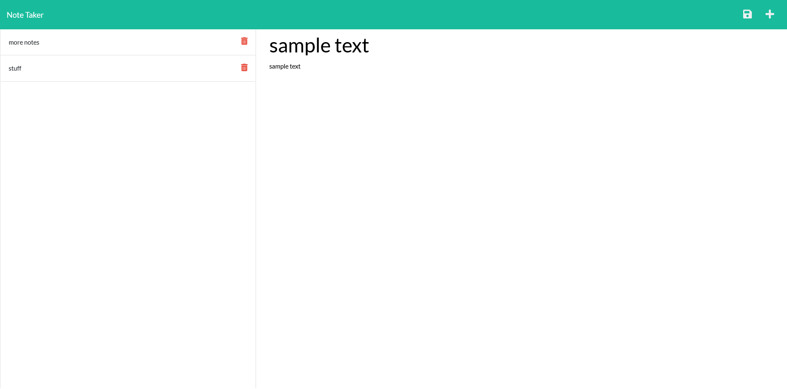

# Note Taker

  
  
## Description
  As an individual, I want to be able to write and save notes so that I can keep track of tasks I need to complete.  To that end, I have gone about writing the back end script for a small note taker app that allows me to do just that.
  
## Table of contents

[Description](#description)

[Installation](#installation)

[Usage](#usage)

[Test](#test)

[Contribution](#contribution)

[License](#license)

[Questions](#questions)
  
## Installation
  This project requires the following dependencies to function: none, just click the deployed link for the heroku app site.
  
## Usage
  To use this project, click on the get started button located on the main page to be taken to the notes page.  Once there, you can create new notes or delete notes that you've already made that are no longer required.
  
  Link to deployed app:  https://arcane-fortress-25540.herokuapp.com/
  
## Test
  To test this application on your own, download the code into vs code on your system, make sure to have node installed as well, then do an npm install in vs codes integrated terminal to install all dependencies and run it using node server.js.  Afterwards, go to the browser of your choice and go to localhost3001.

  Screenshots:
  
  
  
  
## Contribution
  To contribute to this project, N/A
  
## License
  This project is licensed under the [MIT License](https://opensource.org/licenses/MIT).

## Questions?
  For any questions, please contact me at one of the following links.

  GitHub: https://github.com/Kalmnir
  
  Email: jmsackett91@gmail.com

